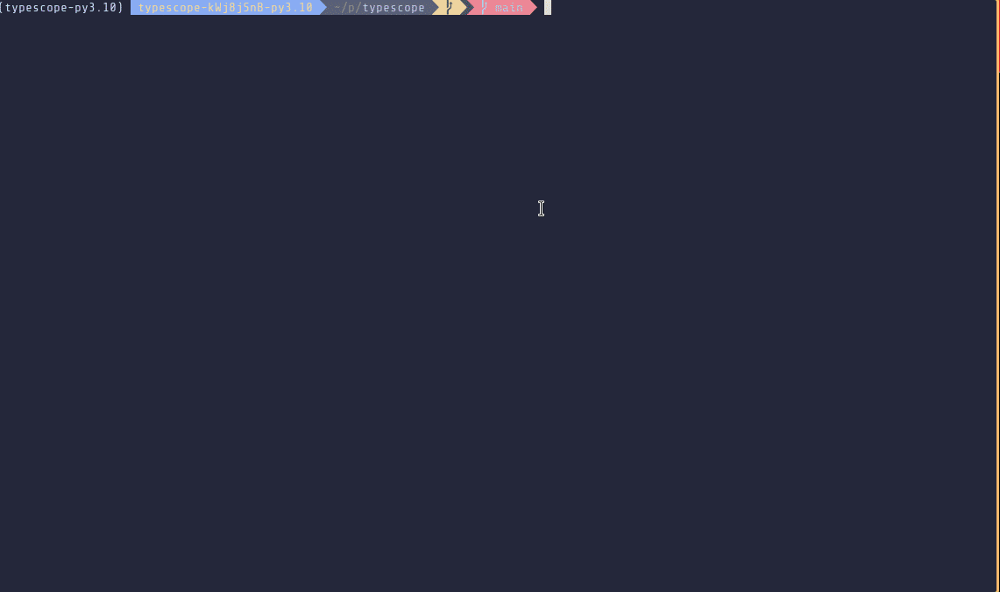

# `typescope`

## What is this?

`typescope` is a terminal-based interface to explore typing annotations in your Python code. You can explore the types in your codebase by simply hovering your mouse over a part of the code.

It's currently in a very early development stage, more of a proof of concept, really. The code is pretty messy, features are lacking and stability is non-existent. That said, it _could_ be described as useful already, and in the spirit of building in public, though, here it is :)

### How does it work?

I'm glad you asked! (man, I love being able to control both sides of a dialogue)

`typescope` is powered primarily by the fantastically written and designed [`libcst`](). It gathers information on the nodes in the syntax tree such as their position in code, their inferred types, and fully qualified names, the latter two of which are in turn provided by [`pyre`](). Then, we build an [interval tree]() indexed by node position so we can quickly look up the info and display it on the screen. There's also a cache layer to skip unnecessary parsing and type inference - this is built with [`diskcache`]().

On the display side of things, the terminal interface is rendered by [`textual`](). I'm still kind of getting to know the library, so it's likely that the code for this isn't quite the best one.

### Why?

Because as software engineers/builders/artisans/poets/monkeys, [we should try to have as direct a connection as possible to the things we're building](). Static type analysis in Python is _great_. It really helps a bunch. But it's not as helpful as it could be if I don't use it as much because writing a bunch of `reveal_type`, then running a tool, then commenting them out isn't a functional part of a workflow. Typing should provide me with insights_. It shouldn't be limited to passively answering my questions - rather, it should actively tell me things and give me updates which anticipate my questions and allow me to ask more effective ones.

Especially when writing complex code such as code which manipulates a syntax tree or which deals with data flow and higher-order functions, relevant type information is a boon for checking our assumptions and making mental bridges across concepts. 

I'm reminded of solving physics questions in university by treating units of measure as a part of a puzzle. If I get to some part of a problem where I'm supposed to, say, have an acceleration, but I came up with a velocity, and knowing that acceleration is defined as a change in velocity over time (e.g. `m/s` vs. `m/s**2`) then I have an idea about where to start looking for a mistake - I may have forgotten to divide by time at some point. Likewise in code, if I came up with a list of values when I intended to have only one value, then maybe that `map` back there should actually have been a `flatmap`. Having a tool which tells you immediately of any mismatches between your intentions and what's actually helping is invaluable! 

### How do I run it?

The code is currently in a very early stage, so there's no package yet. If want to try it out, you can follow these steps:

1. Clone the repo
2. `cd` into the repo
3. Create a `poetry` environment and install the project
4. Before running typescope, start a `pyre` server in the project directory
5. Run `poetry run typescope <project path>`

### What's on the roadmap?

I'm still exploring ideas on how to make this visualization as useful as possible. Some of the things I'd like to have include
- Simplified view of inferred types
	- Currently, the type inference string provided by Pyre is somewhat verbose an unwieldy. It's important to make this legible. It _almost, kind of, maybe_ parses as a CST node we can use, and does with a few string replacements, so I'll likely add some logic for the most common cases.
- Keep track of watched names, even across files
	- Provide the ability to click some names and have them be always visible.
- Quick go to definition/find usages
	- We already have fully qualified names, so it shouldn't be hard to make an index of these to their definition and usages.
- Scope analysis
	- This is an important one, and the use case I originally envisioned `typescope` for. 
	- When I'm working on some code, the most helpful thing I think a static type analysis tool could provide me is a view of my surroundings, and yet no tools do that.
	- This view would include the names defined in the local and module scope I'm writing code in, their types, and whether there's any mismatches between declared/inferred types. After the qualified name -> node index is in, it'll also show e.g. the types for functions being used.
	- Maybe use some AI? There's a lot of possibilities. Embeddings could be used to find related pieces of code; LLM logits could be used to provide a "heatmap" of how unexpected a segment of code is to the model (which points out potential bugs). 
- IDE integration
	- This is a doozy, writing plugins sucks (or maybe it's just not something I've done before so it looks from here like a bunch of work). I use PyCharm, so if it does happen, that's likely to be the first target.
	- There _is_ a dirty little thing that's doable short-term. Jetbrains IDEs have an obscure nearly undocumented REST server that provides a couple of features that could be nice to have; in particular, I remember there's something that allowed you the send a request and have the editor go to a particular location in code. 
